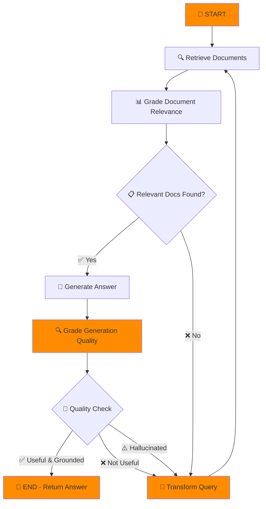

# 🤖 Self-RAG Groq Chatbot with Docling & GIST Embeddings

> A sophisticated RAG (Retrieval-Augmented Generation) chatbot implementing Self-RAG methodology with advanced PDF processing and semantic understanding capabilities powered by Groq's lightning-fast inference.

## ✨ Features

- 🧠 **Self-RAG Implementation**: Advanced retrieval-augmented generation with self-reflection and iterative refinement
- ⚡ **Groq-Powered Inference**: Ultra-fast LLM responses using Groq's optimized infrastructure
- 📄 **Smart PDF Processing**: High-quality document parsing using Docling for accurate text extraction
- 🎯 **Semantic Understanding**: GIST embeddings for superior document comprehension and retrieval
- 🛡️ **Rate Limiting**: Built-in intelligent rate limiting for Groq API to prevent quota exhaustion
- 🖥️ **Interactive Web UI**: Clean and intuitive Streamlit interface with real-time chat
- 🔄 **Document Grading**: Automatic relevance scoring and hallucination detection
- 📊 **Usage Monitoring**: Real-time API usage tracking and limit visualization

## 🛠️ Technology Stack

### **Core Framework**
- 🌟 **Streamlit** - Interactive web application framework
- 🏗️ **LangGraph** - Workflow orchestration and state management

### **AI/ML Components**
- 🚀 **Groq API** - Ultra-fast LLM inference (gemma2-9b-it model)
- 🤖 **LangChain** - RAG pipeline and prompt management
- 🎯 **GIST Embeddings** - Advanced semantic text embeddings
- 📚 **SentenceTransformers** - Embedding model infrastructure

### **Document Processing**
- 📄 **Docling** - High-quality PDF parsing and text extraction
- ✂️ **Semantic Chunker** - Intelligent document segmentation

### **Vector Storage**
- 🗃️ **ChromaDB** - Efficient vector database for embeddings
- 🔍 **Similarity Search** - Fast semantic document retrieval

### **Data & Utilities**
- 📋 **Pydantic** - Data validation and structured outputs
- 🔒 **Threading** - Thread-safe rate limiting
- ⏰ **DateTime** - Time-based API quota management

## 🔄 Self-RAG Workflow



## 🚀 Quick Start

### Prerequisites
- 🐍 Python 3.12 or higher
- 🔑 Groq API key ([Get one here](https://console.groq.com/))

### Installation

1. **Clone the repository:**
```bash
git clone https://github.com/bsasidharan15/self-rag-groq-chatbot.git
cd self-rag-groq-chatbot
```

2. **Install dependencies:**
```bash
pip install -r requirements.txt
```

3. **Configure API Key:**
Update the API key in `app.py` at line 628, or set it as an environment variable:
```python
groq_api_key = "your_groq_api_key_here"
```

Alternatively, set as environment variable:
```bash
export GROQ_API_KEY="your_groq_api_key_here"
```

4. **Run the application:**
```bash
streamlit run app.py
```

5. **Open your browser:**
Navigate to `http://localhost:8501` to start using the chatbot! 🎉

## 📖 How to Use

### **Step 1: Document Upload**
- 📁 Use the sidebar to upload PDF files or enter document URLs
- 📚 Multiple documents supported for comprehensive knowledge base

### **Step 2: Document Processing**
- ⚙️ Click "Process Documents" to create the vector knowledge base
- 🔄 Watch the progress as documents are parsed and embedded

### **Step 3: Interactive Chat**
- 💬 Ask questions about your documents in the chat interface
- 🧠 Experience Self-RAG's intelligent retrieval and generation process

### **Step 4: Monitor Performance**
- 📊 Check API rate limits and usage in the sidebar dashboard
- ⚡ View real-time Groq API performance metrics

## 🔧 Configuration

### **Model Settings**
- **LLM Model**: `gemma2-9b-it` (Groq)
- **Embedding Model**: `avsolatorio/GIST-large-Embedding-v0`
- **Fallback Model**: `sentence-transformers/all-MiniLM-L6-v2`

### **Groq API Rate Limits**
- 📈 **RPM**: 30 requests per minute
- 🚀 **TPM**: 15,000 tokens per minute  
- 📅 **RPD**: 14,400 requests per day
- 💾 **TPD**: 500,000 tokens per day

### **Self-RAG Parameters**
- **Recursion Limit**: 10 iterations max
- **Chunk Size**: Minimum 50 characters
- **Semantic Threshold**: 80th percentile breakpoint

## 🏗️ Architecture

The application follows a modular architecture optimized for Groq's high-speed inference:

```
📦 Self-RAG Groq Chatbot
├── 🚀 GroqLLM - High-speed API client with rate limiting
├── 🧬 GISTEmbeddings - Semantic embedding model
├── 📊 SelfRAGChatbot - Main orchestration class
├── 🔄 StateGraph - LangGraph workflow engine
├── 📋 Pydantic Models - Data validation schemas
└── 🖥️ Streamlit UI - Web interface components
```

## 🎯 Self-RAG Process

The Self-RAG methodology ensures high-quality, grounded responses:

1. **🔍 Document Retrieval**: Query vector database for semantically relevant chunks
2. **📊 Relevance Grading**: AI evaluates document relevance to user question
3. **🎯 Answer Generation**: Create response using relevant context with Groq's fast inference
4. **🔍 Quality Assessment**: Check for hallucinations and factual accuracy
5. **🔄 Iterative Refinement**: Retry with improved queries if quality standards not met

## 🛡️ Error Handling & Reliability

- ⚡ **Rate Limit Protection**: Automatic waiting and retry logic for Groq API
- 🔄 **Fallback Mechanisms**: Graceful degradation when limits exceeded  
- 🛠️ **Recursion Prevention**: Max iteration limits to avoid infinite loops
- 📝 **Comprehensive Logging**: Detailed error reporting and user feedback
- 🚨 **API Health Monitoring**: Real-time Groq service status checking

## 📊 Performance Features

- ⚡ **Lightning Fast**: Groq's optimized inference for sub-second responses
- 🧠 **Smart Caching**: Efficient vector similarity search with ChromaDB
- 📈 **Scalable**: Handles large document collections efficiently
- 🔄 **Adaptive**: Self-improving through iterative refinement

## 🛠️ Development

### **Project Structure**
```
self-rag-groq-chatbot/
├── app.py                 # Main Streamlit application
├── requirements.txt       # Python dependencies
├── README.md             # Project documentation
├── LICENSE               # MIT License
└── docs/                 # Additional documentation
    ├── api-reference.md
    └── deployment.md
```

### **Key Dependencies**
```
streamlit>=1.28.0
langchain>=0.1.0
langgraph>=0.0.40
groq>=0.4.0
sentence-transformers>=2.2.2
chromadb>=0.4.15
docling>=1.0.0
pydantic>=2.0.0
```

## 🚀 Deployment

### **Local Development**
```bash
# Development mode with hot reload
streamlit run app.py --server.runOnSave true
```

### **Production Deployment**
```bash
# Using Docker
docker build -t self-rag-groq-chatbot .
docker run -p 8501:8501 self-rag-groq-chatbot

# Using Streamlit Cloud
# Connect your GitHub repo to Streamlit Cloud
```

## 🤝 Contributing

Contributions are welcome! Please feel free to submit a Pull Request.

### **Contributing Guidelines**
1. 🍴 Fork the repository
2. 🌿 Create your feature branch (`git checkout -b feature/AmazingFeature`)
3. 💾 Commit your changes (`git commit -m 'Add some AmazingFeature'`)
4. 📤 Push to the branch (`git push origin feature/AmazingFeature`)
5. 🔄 Open a Pull Request

For major changes, please open an issue first to discuss what you would like to change.

## 📄 License

This project is licensed under the Apache License 2.0 - see the [LICENSE](LICENSE) file for details.

## 🙏 Acknowledgments

- 🚀 **Groq** for providing ultra-fast LLM inference infrastructure
- 📄 **Docling** team for excellent PDF processing capabilities
- 🎯 **GIST Embeddings** for superior semantic understanding
- 🏗️ **LangChain** community for comprehensive RAG frameworks
- 🌟 **Streamlit** for the amazing web application framework
- 🧠 **LangGraph** for powerful workflow orchestration

## 📞 Support

- 🐛 **Bug Reports**: [Create an issue](https://github.com/bsasidharan15/self-rag-groq-chatbot/issues)
- 💡 **Feature Requests**: [Request a feature](https://github.com/bsasidharan15/self-rag-groq-chatbot/issues)
- 💬 **Discussions**: [Join the conversation](https://github.com/bsasidharan15/self-rag-groq-chatbot/discussions)

## 📈 Roadmap

- [ ] 🔄 Multi-language support
- [ ] 📊 Advanced analytics dashboard
- [ ] 🔌 Additional LLM provider integrations
- [ ] 📱 Mobile-responsive UI improvements
- [ ] 🎨 Customizable chat themes
- [ ] 📡 API endpoint for external integrations

---

**Built with ❤️ using cutting-edge AI technologies and Groq's blazing-fast inference**

[⭐ Star this repo](https://github.com/bsasidharan15/self-rag-groq-chatbot) • [🐛 Report Bug](https://github.com/bsasidharan15/self-rag-groq-chatbot/issues) • [✨ Request Feature](https://github.com/bsasidharan15/self-rag-groq-chatbot/issues) • [💬 Discussions](https://github.com/bsasidharan15/self-rag-groq-chatbot/discussions)

[](https://streamlit.io/)
[](https://groq.com/)
[](https://python.org/)
[](LICENSE)
